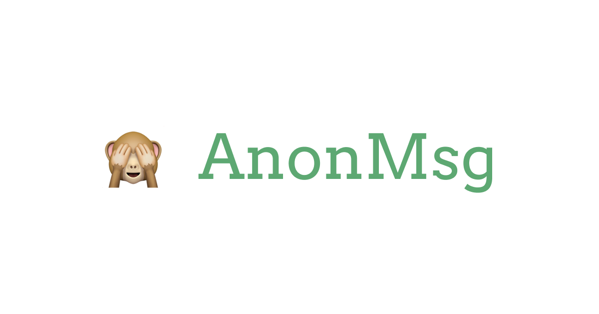
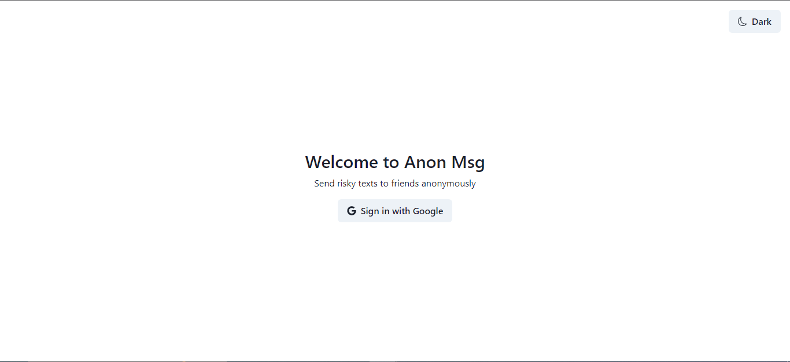
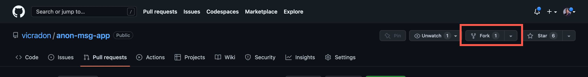
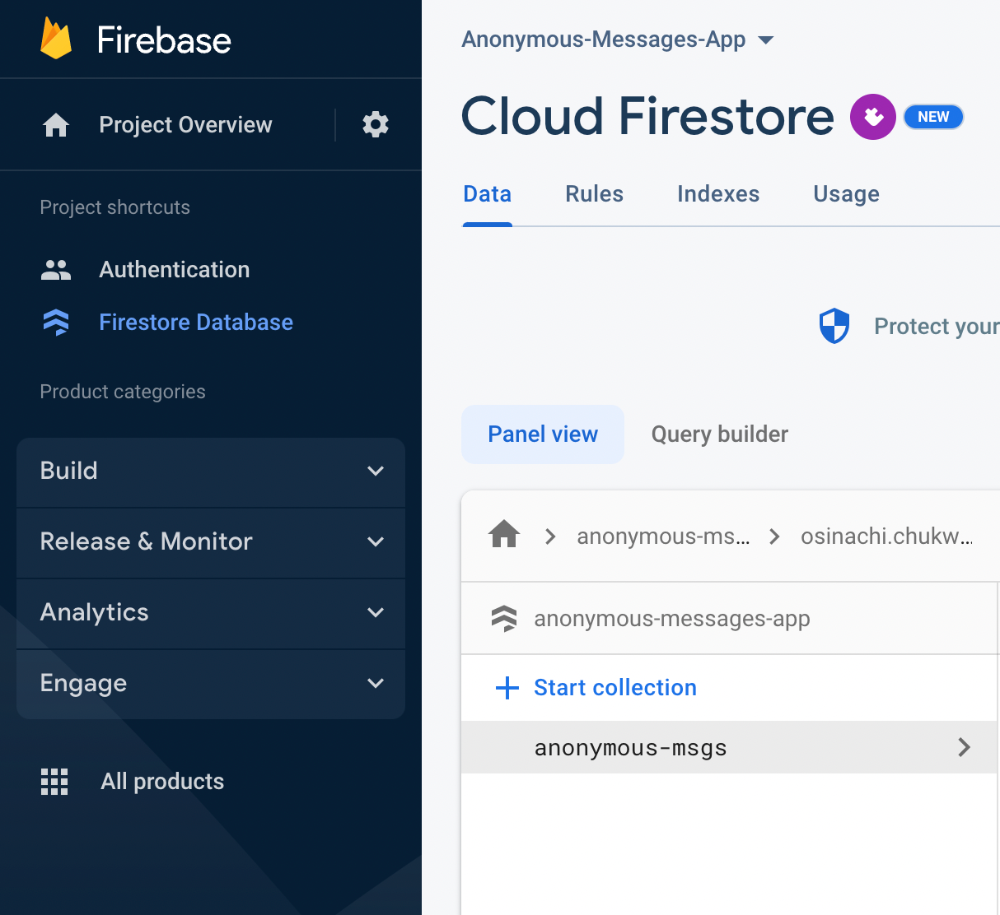
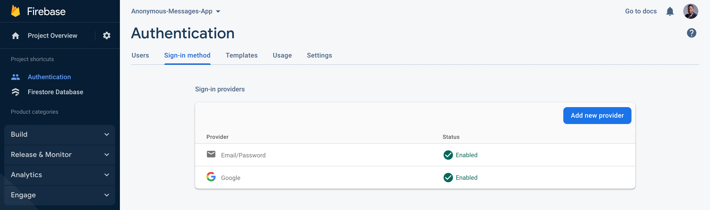

# AnonMsg🙈



## About AnonMsg🙈

AnonMsg is a fun and interactive social media platform that allows users to share links to ask their friends, family, and followers to send anonymous messages, and to ask questions about them in order to learn what people think of them and beyond, having fun and indepth conversations.

Users can quickly share their link and begin reading messags as they get responses.

In order for users' connections and followers to participate in anonymous messaging, AnonMsg makes it incredibly simple for users to post their link on other social networking sites as well.

You may check out how it works and [get started](https://anon-msg-app.vercel.app/) for free if you don't already have an account.

## Features

1. Anonymity 👓
   > When you send someone a secret message, our platform protects your privacy to keep you anonymous. You remain anonymous unless you decide to expose your true identity.
2. Simple to Use 💫
   > We are continually improving the platform, to make AnonMsg🙈 as user-friendly as possible.To get started right now, all you need to do is to go to [AnonMsg🙈](https://anon-msg-app.vercel.app/)and enter your login and password.
3. Secure & Private 🔒
   > With AnonMsg🙈 messages are secured with aes cipher encryption and your account is secure.
4. 100% Free 🆓
   > Access all of AnonMsg🙈 features for free without paying a penny.

## View

Go to [AnonMsg🙈](https://anon-msg-app.vercel.app/) to get started

## WebApp Screenshots

### Web view




### Mobile view


## Technology

Visit the [tech doc](./technology_readme.md) to learn about the technologies used in this project.

## How to Contribute

1. Fork the repo to your Github account



2. Clone the repo you just forked to your local machine

```bash
git clone https://github.com/your-username/anon-msg-app.git
cd anon-msg-app

```

3. Open a terminal in the root directory of the project and run the following command to install all the dependencies

```bash
npm install
```

4. Copy the `.env.example` file and rename it to `.env.local`

```bash
cp .env.example .env.local
```

5. Create a new firebase project and add the firebase config to the `.env.local` file. Also, generate a 64 character secret key and add it to the CRYPTO_SECRET_KEY key of `.env.local` file.

```bash
NEXT_PUBLIC_FIREBASE_API_KEY=Your firebase apiKey
NEXT_PUBLIC_FIREBASE_AUTH_DOMAIN=Your firebase authDomain
NEXT_PUBLIC_FIREBASE_PROJECT_ID=Your firebase projectId
NEXT_PUBLIC_FIREBASE_STORAGE_BUCKET=Your firebase storageBucket
NEXT_PUBLIC_FIREBASE_MESSAGING_SENDER_ID=Your firebase messagingSenderId
NEXT_PUBLIC_FIREBASE_APP_ID=Your firebase appId
NEXT_PUBLIC_FIREBASE_MEASUREMENT_ID=Your firebase measurementId
CRYPTO_SECRET_KEY=example secret key z6yyxzq548nn6qkx8kmr1b4oir84gq2eocvqi4q2q7t2atm477npupl7yjg4ol71 (do not use this one)
```

6. Create a Firestore database in your firebase project and add the following collections

```bash
anonymous-messages
```



7. Enable email and Google authentication in your firebase project



8. Create a new branch for your feature

```bash
git checkout -b my-feature
```

9. Run the following command to start the development server

```bash
npm run dev
```

10. Open [http://localhost:3000](http://localhost:3000) with your browser to see the result.

11. Make your changes and commit them

```bash
git add .
git commit -m "my feature"
```

12. Push your changes to your forked repo

```bash
git push origin my-feature
```

13. Open a pull request to the main repo

## License

[MIT](./LICENSE)
